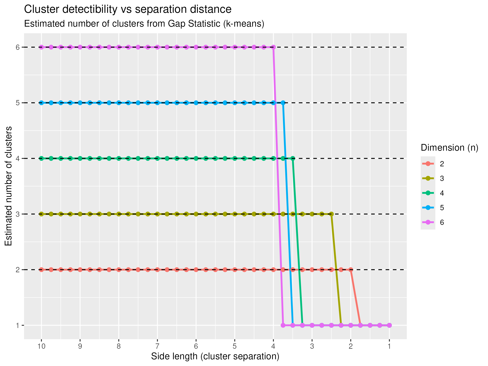

# Task 1: K-Means Clustering on Hypercube Data

In this task, I generated data from clusters centered at the positive corners of an $n$-dimensional hypercube. Each corner represented a separate cluster. The goal was to determine how close the clusters could be moved toward the origin before k-means clustering and the `clusGap()` function used for determining the optimal number of clusters failed to detect the true number of clusters.

For each dimension $n = 2, 3, 4, 5, 6$, I gradually decreased the side length of the hypercube and evaluated whether `clusGap()` selected the correct number of clusters. The results showed a clear inflection point: when the side length was large enough, the algorithm performed well, but below a certain threshold, the clusters became too close for k-means to reliably distinguish.

Specifically:

-   For $n = 6$, the correct number of clusters was identified when the side length ≥ 4.
-   For $n = 5$, the inflection occurred at 3.75.
-   For $n = 4$, at 3.5.
-   For $n = 3$, at 2.5.
-   For $n = 2$, at 2.

This pattern reflects that as the dimensionality increases, clusters must be spaced further apart in Euclidean distance for k-means to detect them as distinct.

The figure below summarizes these findings.

# Task 2: Spectral Clustering on 3D Shell Data

In the second task, I implemented spectral clustering on data arranged in three-dimensional shells, designed to test whether the algorithm could distinguish multiple concentric clusters as they were moved closer together.

Each dataset consisted of four shells with evenly spaced radii between 0 and a set maximum radius, with 100 points per shell. Points were connected in a similarity graph using an adjacency matrix where $A_{ij} = 1$ if the Euclidean distance between points $i$ and $j$ was less than 1 (the fixed distance threshold). However, this setup led to challenges:

-   For larger maximum radii (e.g., 10), the outer shells were too sparse. Many points were isolated because no other points were within the threshold distance.
-   These disconnected nodes caused instability and poor performance in spectral clustering and k-means applied to the eigenvector representations.
-   Increasing the distance threshold connected the graph more fully but began to blur boundaries between inner shells, reducing separability.

I attempted a modification to the adjacency matrix construction: if a point had no neighbors within the distance threshold, it was connected to its three nearest neighbors. This reduced sparsity but did not fix the core issue. `clusGap()` still tended to select one cluster across all configurations.

Because constructing the Laplacian and performing eigen-decomposition scale approximately with the square of the number of points ($O(n^2)$), increasing the number of points per shell to fix sparsity quickly became computationally expensive.

In summary, smaller distance thresholds lead to disconnected graphs preventing meaningful structure in the eigenvector representation, and larger thresholds can overconnect the graph and inappropriately merge clusters. Adding more points per shell could help, but with a substantial computational cost. 

The figure below shows the poor detectability behavior using 100 points per cluster and a distance threshold of 1. 

